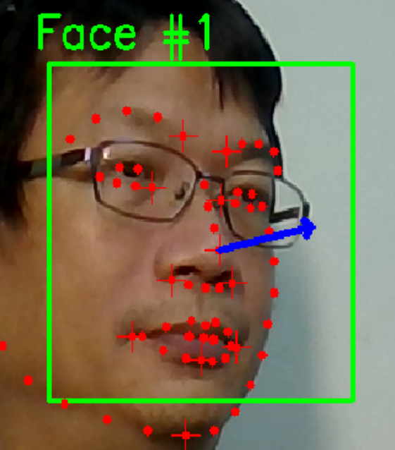

# HeadPose

## 安裝 anaconda3 並修改環境變數
    C:\Users\xxxx\anaconda3  
    C:\Users\xxxx\anaconda3\Scripts  
    C:\Users\xxxx\anaconda3\Library\bin  

## 建立隔離空間
    conda create -n headpose python=3.6.9  
    conda activate headpose  

## 刪除隔離空間
    conda remove -n headpose  

## 安裝 opencv
    pip install opencv-python  
    pip install --upgrade imutils  

## 安裝 dlib
    pip install wheel  

    pip install dlib  
    or  
    python -m pip install https://files.pythonhosted.org/packages/0e/ce/f8a3cff33ac03a8219768f0694c5d703c8e037e6aba2e865f9bae22ed63c/dlib-19.8.1-cp36-cp36m-win_amd64.whl#sha256=794994fa2c54e7776659fddb148363a5556468a6d5d46be8dad311722d54bfcf  

## 執行主程式
    python FaceCV.py

## 圖示

顯示面部方向

# 參考資料

## Head orientation estimation using Python and OpenCV + dlib
https://linuxtut.com/en/1e68a7572bc5736d474e/

## Head Pose Estimation using OpenCV and Dlib
https://learnopencv.com/head-pose-estimation-using-opencv-and-dlib/

## 人臉姿態估計
https://www.twblogs.net/a/5b7aba1f2b7177392c96b171

## github 參考程式碼
https://github.com/lincolnhard/head-pose-estimation

