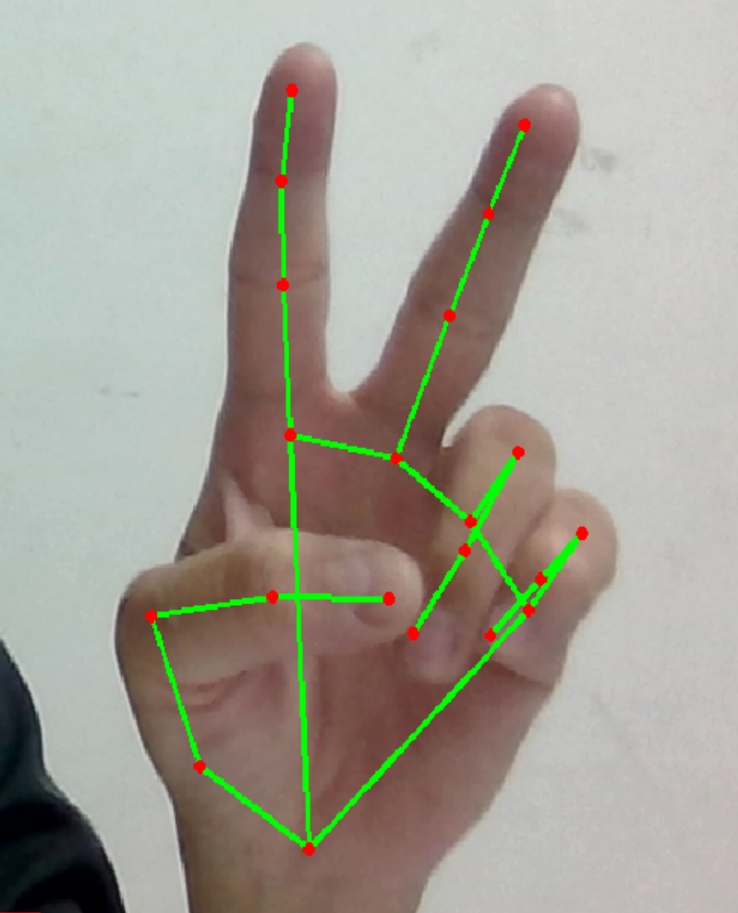

# HeadPose

## 安裝 miniconda 並修改環境變數
    C:\Users\xxxx\anaconda3  
    C:\Users\xxxx\anaconda3\Scripts  
    C:\Users\xxxx\anaconda3\Library\bin  

## 建立隔離空間
    conda create -n headpose python=3.6.9
    conda activate headpose

## 刪除隔離空間
    conda remove -n headpose

## 安裝 相關套件
    pip install opencv-python Pillow mediapipe imutils fire

## 安裝 dlib
    pip install dlib
    or
    python -m pip install https://files.pythonhosted.org/packages/0e/ce/f8a3cff33ac03a8219768f0694c5d703c8e037e6aba2e865f9bae22ed63c/dlib-19.8.1-cp36-cp36m-win_amd64.whl#sha256=794994fa2c54e7776659fddb148363a5556468a6d5d46be8dad311722d54bfcf

## 執行主程式
    python HeadPose.py show

## 圖示

顯示面部方向

手部 21 點偵測

# 參考資料

## Head orientation estimation using Python and OpenCV + dlib
https://linuxtut.com/en/1e68a7572bc5736d474e/

## Head Pose Estimation using OpenCV and Dlib
https://learnopencv.com/head-pose-estimation-using-opencv-and-dlib/

## 人臉姿態估計
https://www.twblogs.net/a/5b7aba1f2b7177392c96b171

## github 參考程式碼
https://github.com/lincolnhard/head-pose-estimation

## <a href="https://www.youtube.com/watch?v=x4eeX7WJIuA">OpenCV + MediaPipe 手部追蹤</a>

## <a href="https://www.bilibili.com/video/BV1XA41157pK/">手指計數</a>

# 測試 iris eye tracking 

由於 mediapipe for python 暫不支援 iris face lankmark。 iris 更適合進行眼球追蹤。  
有文章說明如何將 iris 功能加入 python 。
參考文件:  
<a href="https://github.com/google/mediapipe/issues/1530"> Set up iris landmark in python solution #1530 </a>

眼球左右判斷  
<a href="https://www.youtube.com/watch?v=Y-mCtkv41rk">Eyes Tracking with Mediapipe | opencv tutorial | python</a>

[HeadPoseByMediapipe] 用 MediaPipe 偵測 head pose  
<a href="https://www.youtube.com/watch?v=-toNMaS4SeQ">Head Pose Estimation with MediaPipe and OpenCV in Python - OVER 100 FPS!!!</a>